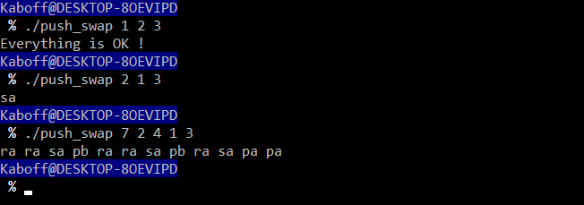

# Push_swap

Ce projet de l'école 42, à réaliser seul, est un programme qui prend des nombres en paramètres et affiche les instructions pour les trier dans l'ordre croissant. Il a un jeu d'instructions limité.

## install & usage

~~~sh
git clone https://github.com/kaboff/Push_swap.git ~/push_swap
cd ~/push_swap && make
~~~

~~~sh
./push_swap [-dnv] [number...]
~~~

## Notice

*sa : swap a - intervertit les 2 premiers éléments au sommet de la pile a. Ne fait rien s’il n’y en a qu’un ou aucun.*

*sb : swap b - intervertit les 2 premiers éléments au sommet de la pile b. Ne fait rien s’il n’y en a qu’un ou aucun.*

*ss : sa et sb en même temps.*

*pa : push a - prend le premier élément au sommet de b et le met sur a. Ne fait rien si b est vide.*

*pb : push b - prend le premier élément au sommet de a et le met sur b. Ne fait rien si a est vide.*

*ra : rotate a - décale d’une position vers le haut tous les élements de la pile a. Le premier élément devient le dernier.*

*rb : rotate b - décale d’une position vers le haut tous les élements de la pile b. Le premier élément devient le dernier.*

*rr : ra et rb en même temps.*
 
*rra : reverse rotate a - décale d’une position vers le bas tous les élements de la pile a. Le dernier élément devient le premier.*
 
*rrb : reverse rotate b - décale d’une position vers le bas tous les élements de la pile b. Le dernier élément devient le premier.*

*rrr : rra et rrb en même temps.*

